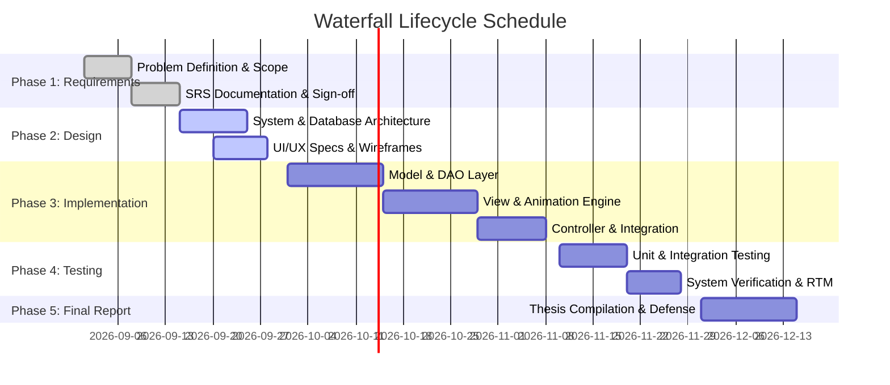

# Feasibility Study Report
## RailFlow — Train Ticket Management Application
**Project Phase:** Phase 1 (Waterfall Inception & Analysis)  

---

## 1. Technical Feasibility
- **Technology Stack**: Java 21, Swing, FlatLaf, HikariCP, MySQL 8.x.
- **Feasibility Assessment**: High.
  - Java 21 provides enterprise-grade stability, long-term support (LTS), and modern runtime optimizations.
  - Swing enables direct control over `Graphics2D` pipelines, allowing high-performance double-buffered rendering for custom spring-physics animations without external heavy dependencies.
  - FlatLaf provides cross-platform High-DPI support, dynamic dark mode, and vector SVG rasterization.
  - HikariCP guarantees sub-millisecond connection pooling overhead.

---

## 2. Operational Feasibility
- **Target Users**: General railway passengers and railway administrative operators.
- **Usability Factors**:
  - The interface follows strict minimalist principles with intuitive visual affordances, replacing clunky traditional railway forms with responsive 24px pill controls and interactive coach seat maps.
  - Fluid spring animations provide immediate tactile feedback, reducing operator error and double-booking mistakes.

---

## 3. Economic Feasibility
- **Cost Analysis**:
  - **Development Cost**: $0 (100% open-source software stack: Java OpenJDK, FlatLaf, MySQL Community Edition, Maven, VS Code/IntelliJ Community).
  - **Deployment Hardware**: Standard consumer PC/laptop with 4GB+ RAM and standard dual-core processor.
- **Feasibility Assessment**: Highly Feasible with zero licensing expenditure.

---

## 4. Schedule & Waterfall Milestones

