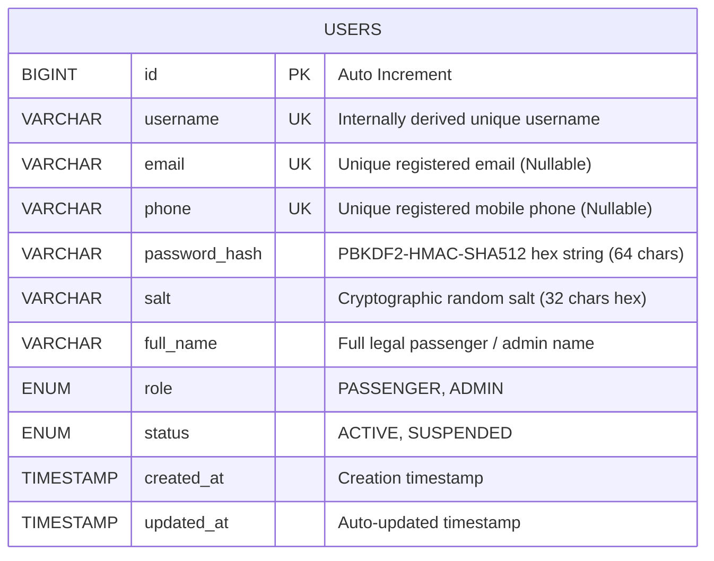

# Database Design & Persistence Strategy
## RailFlow — Train Ticket Management Application
**Document Status:** Working Draft (To be evolved iteratively alongside code)

---

## 1. Database Philosophy & Persistence Approach
- **Engine**: MySQL 8.x / ANSI-SQL compatible relational database.
- **Access Strategy**: Pure JDBC using `PreparedStatement` to ensure SQL injection prevention and optimal driver-level query caching.
- **Connection Management**: High-performance connection pooling via **HikariCP**.
- **Transactions**: Multi-table operations (e.g. seat locking, booking creation, payment logging) will be wrapped in explicit transactions (`connection.setAutoCommit(false)` with rollback on exception).
- **Normalization**: Relational schema targeting Third Normal Form (3NF) to eliminate data redundancy.

---

## 2. Core Domain Entities

1. **User & Authentication Entity (`users`)**: Authenticated passengers and system administrators with Role-Based Access Control (RBAC). Passwords are cryptographically salted and hashed using PBKDF2 with HMAC-SHA-512 (65,536 iterations).
2. **Station & Route Entities**: Railway stations, routes, and intermediate halts (In progress).
3. **Train & Coach Entities**: Train types, coach compositions, and seating capacities (In progress).
4. **Schedule & Availability Entities**: Train runs, departure/arrival timetables, and real-time seat status.
5. **Booking & Passenger Entities**: Passenger reservations, unique PNR generation, and seat allocation labels.
6. **Payment & Transaction Entities**: Transaction auditing and refund records.

---

## 3. Entity Relationship Diagram (ERD)

---

## 4. Data Dictionary: Table `users`

| Column | Type | Nullable | Key | Default | Description |
|---|---|---|---|---|---|
| `id` | `BIGINT` | No | PK | `AUTO_INCREMENT` | Unique identifier for user account |
| `username` | `VARCHAR(50)` | No | UK | None | Internal login/display identifier (auto-derived from email/phone) |
| `email` | `VARCHAR(100)` | Yes | UK | `NULL` | Registered email address (Primary auth identifier) |
| `phone` | `VARCHAR(20)` | Yes | UK | `NULL` | Registered mobile phone (Primary auth identifier) |
| `password_hash` | `VARCHAR(255)` | No | - | None | Hex-encoded PBKDF2-HMAC-SHA512 hash |
| `salt` | `VARCHAR(64)` | No | - | None | Cryptographically secure random 16-byte hex salt |
| `full_name` | `VARCHAR(100)` | No | - | None | Full legal passenger or administrator name |
| `role` | `ENUM('PASSENGER','ADMIN')` | No | - | `'PASSENGER'` | Access control tier |
| `status` | `ENUM('ACTIVE','SUSPENDED')`| No | - | `'ACTIVE'` | Account standing |
| `created_at` | `TIMESTAMP` | No | - | `CURRENT_TIMESTAMP` | Account creation timestamp |
| `updated_at` | `TIMESTAMP` | No | - | `CURRENT_TIMESTAMP` | Last profile update timestamp |

### 4.1 Fixed Default Administrator Seed
- **Username**: `admin`
- **Role**: `ADMIN`
- **Email**: `admin@railflow.internal`
- **Password**: `admin` (Salt: `0123456789abcdef0123456789abcdef`, Hash: `463d121d09680f21241659d31b0389901d0479bcf389c231258d6c3f5c36050f`)

