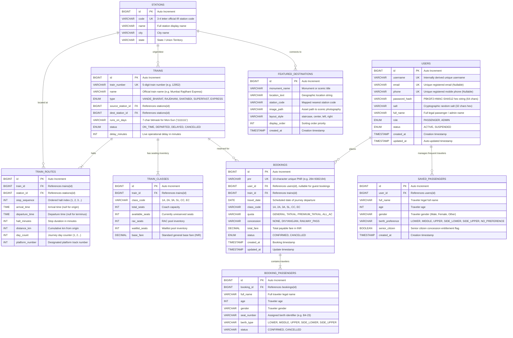

# Database Design & Persistence Strategy
## RailFlow — Train Ticket Management Application
**Document Status:** Complete (Synced with live schema)  
**Detailed Tables Reference:** [SQL Tables Reference Manual](sql-tables-reference.md)

---

## 1. Database Philosophy & Persistence Approach
- **Engine**: MySQL 8.x / ANSI-SQL compatible relational database.
- **Access Strategy**: Pure JDBC using `PreparedStatement` to ensure SQL injection prevention and optimal driver-level query caching.
- **Connection Management**: High-performance connection pooling via **HikariCP**.
- **Transactions**: Multi-table operations (e.g. seat locking, booking creation, payment logging) will be wrapped in explicit transactions (`connection.setAutoCommit(false)` with rollback on exception).
- **Normalization**: Relational schema targeting Third Normal Form (3NF) to eliminate data redundancy.

---

## 2. Core Domain Entities

1. **User & Authentication Entity (`users`)**: Authenticated passengers and system administrators with Role-Based Access Control (RBAC). Passwords are cryptographically salted and hashed using PBKDF2 with HMAC-SHA-512 (65,536 iterations).
2. **Station & Route Entities**: Railway stations, routes, and intermediate halts (In progress).
3. **Train & Coach Entities**: Train types, coach compositions, and seating capacities (In progress).
4. **Schedule & Availability Entities**: Train runs, departure/arrival timetables, and real-time seat status.
5. **Booking & Passenger Entities**: Passenger reservations, unique PNR generation, and seat allocation labels.
6. **Payment & Transaction Entities**: Transaction auditing and refund records.

---

## 3. Entity Relationship Diagram (ERD)



---

## 4. Data Dictionary: Core Tables

### 4.1 Table: `users`
| Column | Type | Nullable | Key | Default | Description |
|---|---|---|---|---|---|
| `id` | `BIGINT` | No | PK | `AUTO_INCREMENT` | Unique identifier for user account |
| `username` | `VARCHAR(50)` | No | UK | None | Internal login/display identifier (auto-derived from email/phone) |
| `email` | `VARCHAR(100)` | Yes | UK | `NULL` | Registered email address (Primary auth identifier) |
| `phone` | `VARCHAR(20)` | Yes | UK | `NULL` | Registered mobile phone (Primary auth identifier) |
| `password_hash` | `VARCHAR(255)` | No | - | None | Hex-encoded PBKDF2-HMAC-SHA512 hash |
| `salt` | `VARCHAR(64)` | No | - | None | Cryptographically secure random 16-byte hex salt |
| `full_name` | `VARCHAR(100)` | No | - | None | Full legal passenger or administrator name |
| `role` | `ENUM('PASSENGER','ADMIN')` | No | - | `'PASSENGER'` | Access control tier |
| `status` | `ENUM('ACTIVE','SUSPENDED')`| No | - | `'ACTIVE'` | Account standing |
| `created_at` | `TIMESTAMP` | No | - | `CURRENT_TIMESTAMP` | Account creation timestamp |
| `updated_at` | `TIMESTAMP` | No | - | `CURRENT_TIMESTAMP` | Last profile update timestamp |

### 4.2 Table: `stations`
| Column | Type | Nullable | Key | Default | Description |
|---|---|---|---|---|---|
| `id` | `BIGINT` | No | PK | `AUTO_INCREMENT` | Station identifier |
| `code` | `VARCHAR(10)` | No | UK | None | Official station alphanumeric code (e.g. `NDLS`, `MMCT`, `BSB`) |
| `name` | `VARCHAR(100)` | No | - | None | Station display name (e.g. `New Delhi`, `Varanasi Junction`) |
| `city` | `VARCHAR(100)` | No | - | None | City name |
| `state` | `VARCHAR(100)` | No | - | None | State or Union Territory |

### 4.3 Table: `trains`
| Column | Type | Nullable | Key | Default | Description |
|---|---|---|---|---|---|
| `id` | `BIGINT` | No | PK | `AUTO_INCREMENT` | Train identifier |
| `train_number` | `VARCHAR(10)` | No | UK | None | Unique 5-digit train number (e.g. `12952`, `22436`) |
| `name` | `VARCHAR(100)` | No | - | None | Commercial train name |
| `type` | `ENUM` | No | - | `'EXPRESS'` | `VANDE_BHARAT`, `RAJDHANI`, `SHATABDI`, `SUPERFAST`, `EXPRESS` |
| `source_station_id` | `BIGINT` | No | FK | None | Origin station reference |
| `dest_station_id` | `BIGINT` | No | FK | None | Terminus station reference |
| `runs_on_days` | `VARCHAR(7)` | No | - | `'1111111'` | Active run schedule bitmask (Mon..Sun) |
| `status` | `ENUM` | No | - | `'ON_TIME'` | `ON_TIME`, `DEPARTED`, `DELAYED`, `CANCELLED` |
| `delay_minutes` | `INT` | No | - | `0` | Real-time operational delay in minutes (0 if on-time) |

### 4.4 Table: `train_routes`
| Column | Type | Nullable | Key | Default | Description |
|---|---|---|---|---|---|
| `id` | `BIGINT` | No | PK | `AUTO_INCREMENT` | Route halt entry ID |
| `train_id` | `BIGINT` | No | FK | None | Parent train reference |
| `station_id` | `BIGINT` | No | FK | None | Halt station reference |
| `stop_sequence` | `INT` | No | - | None | Sequential stop index along the route (1, 2, 3...) |
| `arrival_time` | `TIME` | Yes | - | `NULL` | Scheduled arrival time (null at origin) |
| `departure_time` | `TIME` | Yes | - | `NULL` | Scheduled departure time (null at terminus) |
| `halt_minutes` | `INT` | No | - | `0` | Halt duration in minutes |
| `distance_km` | `INT` | No | - | `0` | Cumulative rail distance from origin |
| `day_count` | `INT` | No | - | `1` | Journey day counter |
| `platform_number`| `INT` | No | - | `1` | Assigned platform track number at the station |

### 4.5 Table: `train_classes`
| Column | Type | Nullable | Key | Default | Description |
|---|---|---|---|---|---|
| `id` | `BIGINT` | No | PK | `AUTO_INCREMENT` | Class pricing/inventory ID |
| `train_id` | `BIGINT` | No | FK | None | Parent train reference |
| `class_code` | `VARCHAR(10)` | No | - | None | `1A`, `2A`, `3A`, `SL`, `CC`, `EC` |
| `total_seats` | `INT` | No | - | `0` | Total coach class capacity |
| `available_seats`| `INT` | No | - | `0` | Real-time unreserved seat inventory |
| `rac_seats` | `INT` | No | - | `0` | Reservation Against Cancellation seats |
| `waitlist_seats`| `INT` | No | - | `0` | Waitlist bookings count |
| `base_fare` | `DECIMAL(10,2)`| No| - | `0.00` | Standard base fare in INR |

### 4.6 Table: `bookings`
| Column | Type | Nullable | Key | Default | Description |
|---|---|---|---|---|---|
| `id` | `BIGINT` | No | PK | `AUTO_INCREMENT` | Unique booking identifier |
| `pnr` | `VARCHAR(20)` | No | UK | None | Formatted 10-character unique PNR (e.g. `284-9382194`) |
| `user_id` | `BIGINT` | Yes | FK | `NULL` | Account holder reference (`users.id`), nullable for guest bookings |
| `train_id` | `BIGINT` | No | FK | None | Reserved train reference (`trains.id`) |
| `travel_date` | `DATE` | No | - | None | Scheduled departure date |
| `class_code` | `VARCHAR(10)` | No | - | `'SL'` | Booked travel class (`1A`, `2A`, `3A`, `SL`, `CC`, `EC`) |
| `quota` | `VARCHAR(30)` | No | - | `'GENERAL'` | Travel quota category |
| `concession` | `VARCHAR(40)` | No | - | `'NONE'` | Concession discount applied |
| `total_fare` | `DECIMAL(10,2)`| No| - | `0.00` | Total confirmed payable amount in INR |
| `status` | `ENUM` | No | - | `'CONFIRMED'`| Reservation state (`CONFIRMED`, `CANCELLED`) |
| `created_at` | `TIMESTAMP` | No | - | `CURRENT_TIMESTAMP` | Reservation creation timestamp |
| `updated_at` | `TIMESTAMP` | No | - | `CURRENT_TIMESTAMP` | Status change timestamp |

### 4.7 Table: `booking_passengers`
| Column | Type | Nullable | Key | Default | Description |
|---|---|---|---|---|---|
| `id` | `BIGINT` | No | PK | `AUTO_INCREMENT` | Passenger record identifier |
| `booking_id` | `BIGINT` | No | FK | None | Parent booking reference (`bookings.id`) |
| `full_name` | `VARCHAR(100)` | No | - | None | Traveler legal name |
| `age` | `INT` | No | - | None | Traveler age |
| `gender` | `VARCHAR(10)` | No | - | None | Traveler gender (`Male`, `Female`, `Other`) |
| `seat_number` | `VARCHAR(20)` | No | - | None | Assigned coach and seat label (e.g. `B4-23`) |
| `berth_type` | `VARCHAR(20)` | No | - | None | Berth preference (`LOWER`, `MIDDLE`, `UPPER`, `SIDE_LOWER`, etc.) |
| `status` | `VARCHAR(20)` | No | - | `'CONFIRMED'`| Traveler seat status |

### 4.8 Table: `saved_passengers`
| Column | Type | Nullable | Key | Default | Description |
|---|---|---|---|---|---|
| `id` | `BIGINT` | No | PK | `AUTO_INCREMENT` | Saved frequent passenger record ID |
| `user_id` | `BIGINT` | No | FK | None | Parent account holder (`users.id`) |
| `full_name` | `VARCHAR(100)` | No | - | None | Legal name of saved traveler |
| `age` | `INT` | No | - | None | Traveler age |
| `gender` | `VARCHAR(10)` | No | - | None | Gender (`Male`, `Female`, `Other`) |
| `berth_preference`| `VARCHAR(20)`| No| - | `'NO_PREFERENCE'` | Preferred berth allocation |
| `senior_citizen`| `BOOLEAN` | No | - | `FALSE` | Senior citizen entitlement flag |
| `created_at` | `TIMESTAMP` | No | - | `CURRENT_TIMESTAMP` | Record creation timestamp |

### 4.9 Table: `featured_destinations`
| Column | Type | Nullable | Key | Default | Description |
|---|---|---|---|---|---|
| `id` | `BIGINT` | No | PK | `AUTO_INCREMENT` | Unique identifier for featured destination |
| `monument_name` | `VARCHAR(100)` | No | - | None | Monument or iconic destination title |
| `location_text` | `VARCHAR(150)` | No | - | None | Geographic location text (e.g. `Agra, Uttar Pradesh`) |
| `station_code` | `VARCHAR(10)` | No | - | None | Nearest railway station code mapped for trip search (e.g. `AGC`) |
| `image_path` | `VARCHAR(255)` | No | - | None | Path to high-resolution photography asset |
| `layout_style` | `VARCHAR(50)` | Yes | - | `''` | Typographic card title style (`staircase`, `center`, `left`, `right`) |
| `display_order` | `INT` | Yes | - | `0` | Sequence priority for display |
| `created_at` | `TIMESTAMP` | No | - | `CURRENT_TIMESTAMP` | Record creation timestamp |

---

## 5. Master Database Seeding & Maintenance Utilities

RailFlow provides automated zero-configuration database seeding via both GUI/shell launchers and a standalone CLI utility:

1. **Terminal Command Line**:
   ```bash
   ./RailFlow.command seed
   ```
   Or via Maven directly:
   ```bash
   mvn exec:java -Dexec.args="seed"
   ```

2. **macOS Finder Double-Click Launchers**:
   - `SeedDatabase.command`: Double-click directly in Finder to populate master tables.
   - `RailFlow.command`: Double-click in Finder; choose option `[2]` or let option `[1]` launch the desktop application automatically after 4 seconds.

3. **Seeded Data Portfolio & Master Database Scripts**:
   - **Canonical Master SQL Script**:
     - `src/main/resources/db/schema.sql`: Single canonical DDL/DML script defining all relational tables, constraints, indices, and comprehensive seed data (101 trains, 50 stations, 420+ halts, 250+ coach inventories, users, and saved passengers).
   - **Stations (50 Master Stations)**: Nationwide coverage across all 6 Indian Railway zones:
     - *North*: New Delhi (`NDLS`), Old Delhi (`DLI`), Hazrat Nizamuddin (`NZM`), Anand Vihar (`ANVT`), Chandigarh (`CDG`), Amritsar (`ASR`), Jammu Tawi (`JAT`), Varanasi (`BSB`), Kanpur Central (`CNB`), Prayagraj (`PRYJ`), Pt. Deen Dayal Upadhyaya (`DDU`), Lucknow Charbagh (`LKO`), Ghaziabad (`GZB`), Aligarh (`ALJN`), Agra Cantt (`AGC`), Gwalior (`GWL`), Gorakhpur (`GKP`).
     - *West*: Mumbai Central (`MMCT`), Chhatrapati Shivaji Maharaj Terminus (`CSMT`), Bandra Terminus (`BDTS`), Pune (`PUNE`), Ahmedabad (`ADI`), Surat (`ST`), Vadodara (`BRC`), Kota (`KOTA`), Jaipur (`JP`), Nagpur (`NGP`), Bhopal Habibganj / RKMP (`BPL`).
     - *South*: Chennai Central (`MAS`), Bengaluru City / KSR (`SBC`), Yesvantpur (`YPR`), Mysuru (`MYS`), Hyderabad Deccan (`HYB`), Secunderabad (`SC`), Vijayawada (`BZA`), Katpadi (`KPD`), Coimbatore (`CBE`), Madurai (`MDU`), Thiruvananthapuram Central (`TVC`), Ernakulam (`ERS`), Kozhikode (`CLT`).
     - *East*: Howrah (`HWH`), Sealdah (`SDAH`), Patna (`PNBE`), Bhubaneswar (`BBS`), Puri (`PURI`), Ranchi (`RNC`).
     - *Central & Northeast*: Raipur (`R`), Guwahati (`GHY`), Dibrugarh (`DBRG`).
   - **Train Fleet (101 Iconic Indian Trains across 17 Major Corridors)**:
     - *Delhi ➔ Mumbai Corridor*: 12952 Tejas Rajdhani, 12954 August Kranti Rajdhani, 12926 Paschim Superfast, 12910 Bandra Garib Rath, 12904 Golden Temple Mail, 22222 Mumbai CSMT Rajdhani, and reverse fleet (12951, 12953, 12925, 12909, 22221).
     - *Delhi ➔ Varanasi Corridor*: 22436 Vande Bharat (Morning), 22416 Vande Bharat (Evening), 12560 Shiv Ganga Superfast, 12582 Banaras Superfast, 15128 Kashi Vishwanath Express, and reverse fleet (22435, 22415, 12559).
     - *Delhi ➔ Lucknow Corridor*: 12004 Lucknow Swarna Shatabdi, 82502 IRCTC Tejas Express, 12230 Lucknow Mail, 12430 AC Superfast, 12420 Gomti Express, and reverse fleet (12003, 82501, 12229).
     - *Delhi ➔ Kolkata / Howrah Corridor*: 12302 Howrah Rajdhani (via Gaya), 12306 Howrah Rajdhani (via Patna), 12304 Poorva Superfast, 12314 Sealdah Rajdhani, 12312 Netaji Express, and reverse fleet (12301, 12303).
     - *Delhi ➔ Jaipur Corridor*: 12015 Ajmer Shatabdi, 20978 Delhi-Ajmer Vande Bharat, 12986 Double Decker Express, 12958 Swarna Jayanti Rajdhani, 14660 Mandore Express, and reverse fleet (12016, 20977, 12985).
     - *Chennai ➔ Bengaluru & Mysuru*: 20608 Vande Bharat, 12007 Shatabdi Express, 20664 Vande Bharat (Evening), 12027 Shatabdi, 12657 Chennai Mail, 12609 Mysuru Express, and reverse fleet (20607, 12008, 12658).
     - *Mumbai ➔ Ahmedabad Corridor*: 20901 Gandhinagar Vande Bharat, 12009 Shatabdi Express, 12931 Double Decker, 12901 Gujarat Mail, 22953 Gujarat Superfast, and reverse fleet (20902, 12010, 12932, 12902).
     - *Mumbai ➔ Goa Corridor*: 22229 Madgaon Vande Bharat, 12051 Jan Shatabdi, 10103 Mandovi Express, 12133 Mangaluru Superfast, and reverse fleet (22230, 12052).
     - *Delhi ➔ Patna Corridor*: 12394 Sampoorna Kranti Superfast, 12424 Dibrugarh Rajdhani, 12392 Shramjeevi Superfast, 12566 Bihar Sampark Kranti, and reverse fleet (12393, 12423).
     - *Delhi ➔ Chandigarh & Amritsar*: 12046 Chandigarh Shatabdi, 12011 Kalka Shatabdi, 12005 Kalka Shatabdi (Evening), 22447 Vande Bharat, 12029 Swarna Shatabdi, 12497 Shan-e-Punjab, and reverse fleet (12045, 12012).
     - *Delhi ➔ Jammu Tawi Corridor*: 22439 Katra Vande Bharat, 12425 Jammu Tawi Rajdhani, 12445 Uttar Sampark Kranti, and reverse fleet (22440, 12426).
     - *Delhi ➔ Bhopal & Central India*: 20172 Rani Kamlapati Vande Bharat, 12002 Bhopal Shatabdi, 12920 Malwa Superfast, and reverse fleet (20171, 12001).
     - *Kolkata ➔ Bhubaneswar & Puri*: 22895 Puri Vande Bharat, 12837 Puri Superfast, 12277 Puri Shatabdi, 12821 Dhauli Superfast, and reverse fleet (22896, 12838).
     - *Delhi ➔ Hyderabad / Secunderabad*: 12724 Telangana Superfast, 12438 Secunderabad Rajdhani.
     - *Delhi ➔ Chennai Central*: 12616 Grand Trunk (GT) Express, 12622 Tamil Nadu Superfast.
     - *Delhi ➔ Kerala (TVC)*: 12626 Kerala Superfast Express, and reverse 12625.
     - *Amritsar ➔ Mumbai (ASR ➔ CSMT)*: 12138 Punjab Mail Express, and reverse 12137.
   - **Halts & Inventory**: 420+ halt stop sequence records, 250+ coach class availability records with dynamic quota & concession pricing.
   - **Fixed Admin Seed**: `admin` / `admin` (Station Master dispatch account).
   - **Fixed Demo Passenger**: `passenger1` / `password123` (`passenger1@example.com`).


