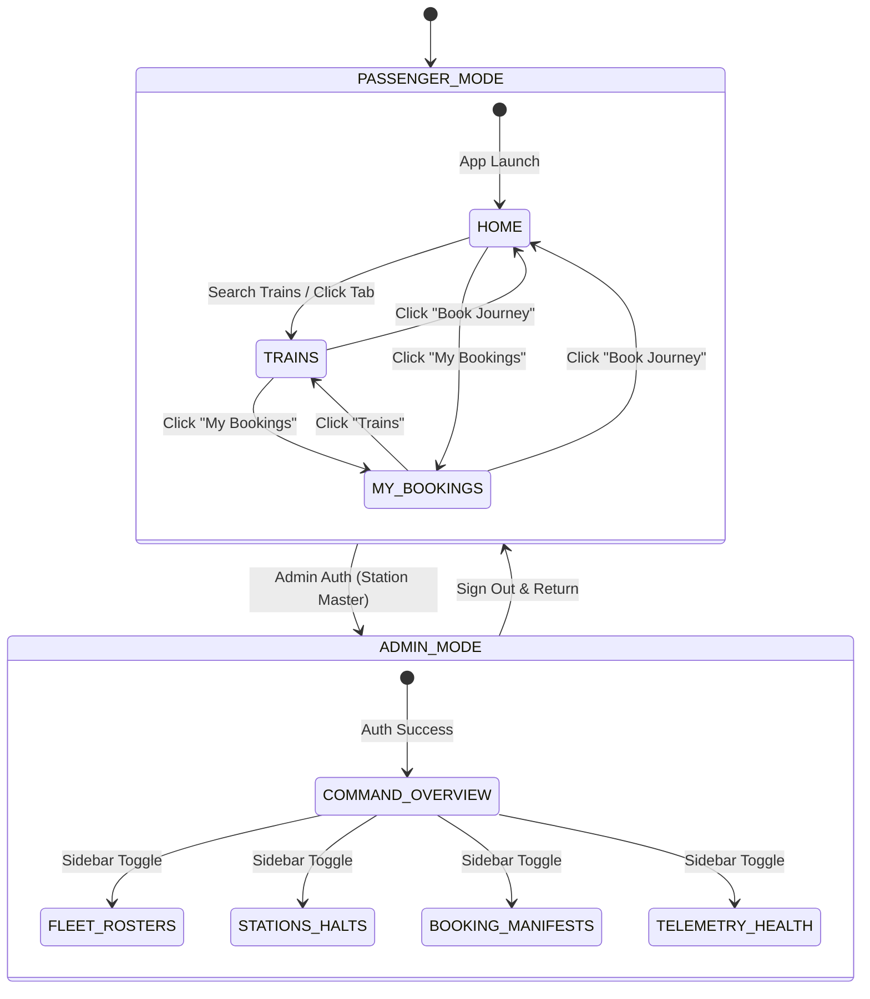

# Architecture: MVC Pattern & Component Communication

This document outlines the Model-View-Controller (MVC) architectural structure and layer responsibilities for RailFlow.

```mermaid
sequenceDiagram
    autonumber
    actor User
    participant V as View (Jelly Animated Swing)
    participant C as Controller
    participant S as Service Layer
    participant D as DAO (JDBC)
    participant DB as SQL Database

    User->>V: Clicks "Book Train" (Squash Animation)
    V->>C: onBookAction(BookingRequestDTO)
    C->>V: showLoadingOverlay(Skeleton Shimmer)
    
    rect rgb(30, 30, 45)
    Note over C,DB: Asynchronous Worker Thread
    C->>S: processBooking(request)
    S->>D: executeTransaction()
    D->>DB: INSERT into bookings & passengers
    DB-->>D: Result Status & Generated PNR
    D-->>S: Booking Confirmation Entity
    S-->>C: BookingConfirmationDTO
    end

    C->>V: SwingUtilities.invokeLater()
    V->>V: triggerTicketCardPopAnimation()
    V->>User: Displays Animated Ticket with Confirmed PNR
```




---

## 1. Responsibilities by Layer

| Layer | Package | Primary Responsibilities | Forbidden Patterns |
|---|---|---|---|
| **Model** | `com.trainticket.model` | Holds business state, validation, entities, DAOs, and SQL operations. | NEVER import `javax.swing.*`, `java.awt.*`, or touch UI state. |
| **View** | `com.trainticket.view` | Displays GUI, executes 60 FPS jelly spring physics, captures user input. | NEVER make direct SQL calls or initiate network requests. |
| **Controller** | `com.trainticket.controller` | Listens to View events, offloads tasks to background threads, updates View via EDT. | NEVER execute blocking code on the Swing Event Dispatch Thread (EDT). |

---

## 2. Asynchronous Execution Contract

All operations involving database latency or heavy computation must be decoupled from the UI thread:

1. **View dispatches event**: Action listener delegates immediately to Controller.
2. **Controller launches background worker**: Uses `SwingWorker` or `CompletableFuture`.
3. **View enters pending state**: A jelly progress indicator or pulsing shimmer displays.
4. **Completion callback returns to EDT**: Results are marshaled back to the EDT via `SwingUtilities.invokeLater()`, triggering entrance animations for the new data.

---

## 3. Desktop Page Routing & State Machine

The top-level window (`MainFrame`) coordinates full application screen transitions via a root `CardLayout` decoupling passenger exploration from administrative operations:



---

## 4. Decomposed Component Hierarchy

To maintain high cohesion and prevent multi-thousand line God classes, RailFlow decomposes complex screens into focused, single-responsibility components:

```
MainFrame
├── AppHeaderPanel (Header branding, CoreAudio output toggle, 3-tab navigation capsule, profile pill)
├── VideoBackgroundPanel (Looping hero.mp4 via JavaFX MediaPlayer)
├── CardLayout (Passenger Views)
│   ├── HomeView (HeroSection, SearchCapsulePanel, FeaturedDestinationsSection)
│   ├── TrainsPageView (SearchCapsulePanel header, Route summary chips, TrainResultCard list)
│   └── MyBookingsPageView (Guest prompt cards, BookingTicketCard list)
└── AdminDashboardView (Embedded Full-Window Admin Mode)
    ├── AdminSidebar (Floating Apple-style panel, 28px corners, soft shadow, 14pt pills: Overview, Fleet, Stations, Bookings, Destinations, Health)
    ├── AdminTopBar (1s live clock, top window clearance, draggable title bar caption)
    └── CardLayout (Overview with AdminStatCards, Fleet, Stations, Bookings, Destinations, Health)
```

