# Architecture: MVC Pattern & Component Communication

This document outlines the Model-View-Controller (MVC) architectural structure and layer responsibilities for RailFlow.

```mermaid
sequenceDiagram
    autonumber
    actor User
    participant V as View (Jelly Animated Swing)
    participant C as Controller
    participant S as Service Layer
    participant D as DAO (JDBC)
    participant DB as SQL Database

    User->>V: Clicks "Book Train" (Squash Animation)
    V->>C: onBookAction(BookingRequestDTO)
    C->>V: showLoadingOverlay(Skeleton Shimmer)
    
    rect rgb(30, 30, 45)
    Note over C,DB: Asynchronous Worker Thread
    C->>S: processBooking(request)
    S->>D: executeTransaction()
    D->>DB: INSERT into bookings & passengers
    DB-->>D: Result Status & Generated PNR
    D-->>S: Booking Confirmation Entity
    S-->>C: BookingConfirmationDTO
    end

    C->>V: SwingUtilities.invokeLater()
    V->>V: triggerTicketCardPopAnimation()
    V->>User: Displays Animated Ticket with Confirmed PNR
```

---

## 1. Responsibilities by Layer

| Layer | Package | Primary Responsibilities | Forbidden Patterns |
|---|---|---|---|
| **Model** | `com.trainticket.model` | Holds business state, validation, entities, DAOs, and SQL operations. | NEVER import `javax.swing.*`, `java.awt.*`, or touch UI state. |
| **View** | `com.trainticket.view` | Displays GUI, executes 60 FPS jelly spring physics, captures user input. | NEVER make direct SQL calls or initiate network requests. |
| **Controller** | `com.trainticket.controller` | Listens to View events, offloads tasks to background threads, updates View via EDT. | NEVER execute blocking code on the Swing Event Dispatch Thread (EDT). |

---

## 2. Asynchronous Execution Contract

All operations involving database latency or heavy computation must be decoupled from the UI thread:

1. **View dispatches event**: Action listener delegates immediately to Controller.
2. **Controller launches background worker**: Uses `SwingWorker` or `CompletableFuture`.
3. **View enters pending state**: A jelly progress indicator or pulsing shimmer displays.
4. **Completion callback returns to EDT**: Results are marshaled back to the EDT via `SwingUtilities.invokeLater()`, triggering entrance animations for the new data.
