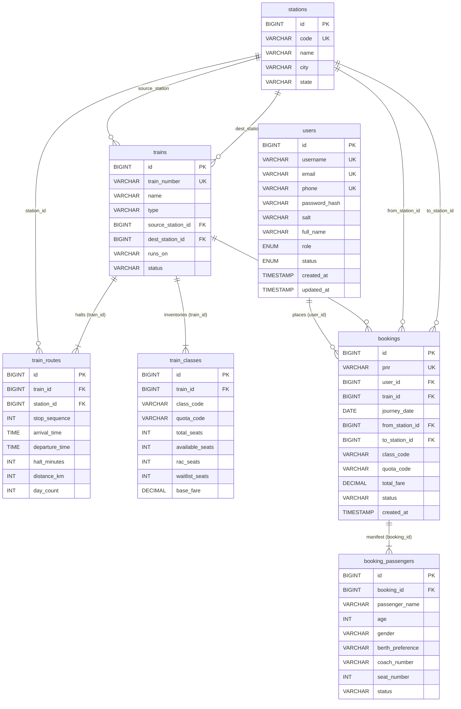

# RailFlow — SQL Database Tables Reference Manual
**Document Status:** Complete SQL Schema & Data Dictionary Reference  
**Dialect:** MySQL 8.x / ANSI SQL  
**Associated Files:** [`schema.sql`](../../src/main/resources/db/schema.sql) | [`seed_data.sql`](../../src/main/resources/db/seed_data.sql) | [`database-design.md`](database-design.md)

---

## 1. Schema Overview

RailFlow utilizes **7 relational tables** normalized to Third Normal Form (3NF) to manage the entire train booking lifecycle:

| # | Table Name | Purpose / Responsibility | Primary Key | Foreign Key Dependencies |
|---|---|---|---|---|
| **1** | [`users`](#1-users) | Passenger accounts, staff credentials, roles (`PASSENGER`, `ADMIN`), and PBKDF2 authentication | `id` | None |
| **2** | [`stations`](#2-stations) | Railway stations, unique alphanumeric junction codes (e.g. `NDLS`, `MMCT`), and geographic locations | `id` | None |
| **3** | [`trains`](#3-trains) | Train fleet inventory, train numbers, origin/dest terminus stations, running days bitmask, and live status | `id` | `source_station_id` &rarr; `stations(id)`<br>`dest_station_id` &rarr; `stations(id)` |
| **4** | [`train_routes`](#4-train_routes) | Sequential intermediate halts, arrival/departure timetables, stoppage durations, and distance metrics | `id` | `train_id` &rarr; `trains(id)`<br>`station_id` &rarr; `stations(id)` |
| **5** | [`train_classes`](#5-train_classes) | Seating inventory, travel classes (`1A`, `2A`, `3A`, `SL`, `CC`, `EC`), quotas, and base fares | `id` | `train_id` &rarr; `trains(id)` |
| **6** | [`bookings`](#6-bookings) | Passenger reservations, 10-digit unique PNR codes, travel dates, itinerary, and payment totals | `id` | `user_id` &rarr; `users(id)`<br>`train_id` &rarr; `trains(id)`<br>`from_station_id` &rarr; `stations(id)`<br>`to_station_id` &rarr; `stations(id)` |
| **7** | [`booking_passengers`](#7-booking_passengers) | Manifest of individual travelers per ticket (up to 6 pax), berth preferences, and assigned coach/seat numbers | `id` | `booking_id` &rarr; `bookings(id)` |

---

## 2. Entity Relationship Diagram (ERD)



---

## 3. Detailed Data Dictionaries & DDL Definitions

### 1. `users`
Stores registered passenger profiles and administrative accounts. Implements cryptographic salting with PBKDF2-HMAC-SHA512.

#### Schema
| Column | Type | Nullable | Key | Default | Description |
|---|---|---|---|---|---|
| `id` | `BIGINT` | No | `PK` | `AUTO_INCREMENT` | Unique identifier for user account |
| `username` | `VARCHAR(50)` | No | `UK` | None | Internal login/display identifier |
| `email` | `VARCHAR(100)` | Yes | `UK` | `NULL` | Registered email address (Primary auth identifier) |
| `phone` | `VARCHAR(20)` | Yes | `UK` | `NULL` | Registered mobile phone (SMS/WhatsApp delivery) |
| `password_hash` | `VARCHAR(255)` | No | - | None | Hex-encoded PBKDF2-HMAC-SHA512 hash |
| `salt` | `VARCHAR(64)` | No | - | None | Cryptographically secure random 16-byte hex salt |
| `full_name` | `VARCHAR(100)` | No | - | None | Full legal passenger or administrator name |
| `role` | `ENUM('PASSENGER','ADMIN')` | No | - | `'PASSENGER'` | Access control tier |
| `status` | `ENUM('ACTIVE','SUSPENDED')`| No | - | `'ACTIVE'` | Account standing |
| `created_at` | `TIMESTAMP` | No | - | `CURRENT_TIMESTAMP` | Account registration timestamp |
| `updated_at` | `TIMESTAMP` | No | - | `CURRENT_TIMESTAMP ON UPDATE CURRENT_TIMESTAMP` | Last profile update timestamp |

#### DDL Statement
```sql
CREATE TABLE IF NOT EXISTS users (
    id BIGINT AUTO_INCREMENT PRIMARY KEY,
    username VARCHAR(50) NOT NULL UNIQUE,
    email VARCHAR(100) NULL UNIQUE,
    phone VARCHAR(20) NULL UNIQUE,
    password_hash VARCHAR(255) NOT NULL,
    salt VARCHAR(64) NOT NULL,
    full_name VARCHAR(100) NOT NULL,
    role ENUM('PASSENGER', 'ADMIN') NOT NULL DEFAULT 'PASSENGER',
    status ENUM('ACTIVE', 'SUSPENDED') NOT NULL DEFAULT 'ACTIVE',
    created_at TIMESTAMP DEFAULT CURRENT_TIMESTAMP,
    updated_at TIMESTAMP DEFAULT CURRENT_TIMESTAMP ON UPDATE CURRENT_TIMESTAMP,
    INDEX idx_users_username (username),
    INDEX idx_users_email (email),
    INDEX idx_users_phone (phone),
    INDEX idx_users_role (role)
) ENGINE=InnoDB DEFAULT CHARSET=utf8mb4 COLLATE=utf8mb4_unicode_ci;
```

---

### 2. `stations`
Master catalog of Indian Railway stations, official junction codes, and territorial states.

#### Schema
| Column | Type | Nullable | Key | Default | Description |
|---|---|---|---|---|---|
| `id` | `BIGINT` | No | `PK` | `AUTO_INCREMENT` | Station identifier |
| `code` | `VARCHAR(10)` | No | `UK` | None | Official station alphanumeric code (e.g. `NDLS`, `MMCT`, `BSB`) |
| `name` | `VARCHAR(100)` | No | - | None | Station display name (e.g. `New Delhi`, `Varanasi Junction`) |
| `city` | `VARCHAR(100)` | No | - | None | City name |
| `state` | `VARCHAR(100)` | No | - | None | State or Union Territory |

#### DDL Statement
```sql
CREATE TABLE IF NOT EXISTS stations (
    id BIGINT AUTO_INCREMENT PRIMARY KEY,
    code VARCHAR(10) NOT NULL UNIQUE,
    name VARCHAR(100) NOT NULL,
    city VARCHAR(100) NOT NULL,
    state VARCHAR(100) NOT NULL,
    INDEX idx_stations_code (code),
    INDEX idx_stations_city (city)
) ENGINE=InnoDB DEFAULT CHARSET=utf8mb4 COLLATE=utf8mb4_unicode_ci;
```

---

### 3. `trains`
Train fleet directory containing train numbers, names, service categories, terminals, and operational schedules.

#### Schema
| Column | Type | Nullable | Key | Default | Description |
|---|---|---|---|---|---|
| `id` | `BIGINT` | No | `PK` | `AUTO_INCREMENT` | Train identifier |
| `train_number` | `VARCHAR(10)` | No | `UK` | None | Unique 5-digit train number (e.g. `12952`, `22436`) |
| `name` | `VARCHAR(150)` | No | - | None | Commercial train name |
| `type` | `VARCHAR(50)` | No | - | None | `VANDE_BHARAT`, `RAJDHANI`, `SHATABDI`, `SUPERFAST`, `EXPRESS` |
| `source_station_id` | `BIGINT` | No | `FK` | None | Origin station reference (`stations.id`) |
| `dest_station_id` | `BIGINT` | No | `FK` | None | Terminus station reference (`stations.id`) |
| `runs_on` | `VARCHAR(7)` | No | - | `'1111111'` | 7-character Mon-Sun bitmask (e.g. `'0110111'`) |
| `status` | `VARCHAR(50)` | No | - | `'ON_TIME'` | `ON_TIME`, `DEPARTED`, `DELAYED`, `CANCELLED` |

#### DDL Statement
```sql
CREATE TABLE IF NOT EXISTS trains (
    id BIGINT AUTO_INCREMENT PRIMARY KEY,
    train_number VARCHAR(10) NOT NULL UNIQUE,
    name VARCHAR(150) NOT NULL,
    type VARCHAR(50) NOT NULL,
    source_station_id BIGINT NOT NULL,
    dest_station_id BIGINT NOT NULL,
    runs_on VARCHAR(7) NOT NULL DEFAULT '1111111',
    status VARCHAR(50) NOT NULL DEFAULT 'ON_TIME',
    FOREIGN KEY (source_station_id) REFERENCES stations(id),
    FOREIGN KEY (dest_station_id) REFERENCES stations(id),
    INDEX idx_trains_number (train_number),
    INDEX idx_trains_source_dest (source_station_id, dest_station_id)
) ENGINE=InnoDB DEFAULT CHARSET=utf8mb4 COLLATE=utf8mb4_unicode_ci;
```

---

### 4. `train_routes`
Ordered stoppage sequences along train routes with scheduled arrival/departure times and cumulative distances.

#### Schema
| Column | Type | Nullable | Key | Default | Description |
|---|---|---|---|---|---|
| `id` | `BIGINT` | No | `PK` | `AUTO_INCREMENT` | Route halt entry identifier |
| `train_id` | `BIGINT` | No | `FK` | None | Parent train reference (`trains.id`) |
| `station_id` | `BIGINT` | No | `FK` | None | Halt station reference (`stations.id`) |
| `stop_sequence` | `INT` | No | - | None | Sequential stop index along the route (1, 2, 3...) |
| `arrival_time` | `TIME` | Yes | - | `NULL` | Scheduled arrival time (null at origin) |
| `departure_time` | `TIME` | Yes | - | `NULL` | Scheduled departure time (null at terminus) |
| `halt_minutes` | `INT` | Yes | - | `0` | Halt duration in minutes |
| `distance_km` | `INT` | No | - | `0` | Cumulative rail distance from origin |
| `day_count` | `INT` | No | - | `1` | Journey day counter |

#### DDL Statement
```sql
CREATE TABLE IF NOT EXISTS train_routes (
    id BIGINT AUTO_INCREMENT PRIMARY KEY,
    train_id BIGINT NOT NULL,
    station_id BIGINT NOT NULL,
    stop_sequence INT NOT NULL,
    arrival_time TIME NULL,
    departure_time TIME NULL,
    halt_minutes INT DEFAULT 0,
    distance_km INT NOT NULL DEFAULT 0,
    day_count INT NOT NULL DEFAULT 1,
    FOREIGN KEY (train_id) REFERENCES trains(id) ON DELETE CASCADE,
    FOREIGN KEY (station_id) REFERENCES stations(id),
    INDEX idx_routes_train_seq (train_id, stop_sequence),
    INDEX idx_routes_station (station_id)
) ENGINE=InnoDB DEFAULT CHARSET=utf8mb4 COLLATE=utf8mb4_unicode_ci;
```

---

### 5. `train_classes`
Coach seating capacity, real-time unreserved availability, RAC/Waitlist tallies, and base fares.

#### Schema
| Column | Type | Nullable | Key | Default | Description |
|---|---|---|---|---|---|
| `id` | `BIGINT` | No | `PK` | `AUTO_INCREMENT` | Class pricing/inventory identifier |
| `train_id` | `BIGINT` | No | `FK` | None | Parent train reference (`trains.id`) |
| `class_code` | `VARCHAR(10)` | No | - | None | `1A`, `2A`, `3A`, `SL`, `CC`, `EC` |
| `quota_code` | `VARCHAR(20)` | No | - | `'GENERAL'` | `GENERAL`, `TATKAL`, `PREMIUM_TATKAL` |
| `total_seats` | `INT` | No | - | None | Total coach class capacity |
| `available_seats`| `INT` | No | - | None | Real-time unreserved seat inventory |
| `rac_seats` | `INT` | No | - | `0` | Reservation Against Cancellation seats pool |
| `waitlist_seats`| `INT` | No | - | `0` | Waitlist bookings pool |
| `base_fare` | `DECIMAL(10, 2)`| No| - | None | Standard general base fare in INR |

#### DDL Statement
```sql
CREATE TABLE IF NOT EXISTS train_classes (
    id BIGINT AUTO_INCREMENT PRIMARY KEY,
    train_id BIGINT NOT NULL,
    class_code VARCHAR(10) NOT NULL,
    quota_code VARCHAR(20) NOT NULL DEFAULT 'GENERAL',
    total_seats INT NOT NULL,
    available_seats INT NOT NULL,
    rac_seats INT NOT NULL DEFAULT 0,
    waitlist_seats INT NOT NULL DEFAULT 0,
    base_fare DECIMAL(10, 2) NOT NULL,
    FOREIGN KEY (train_id) REFERENCES trains(id) ON DELETE CASCADE,
    INDEX idx_classes_train_code (train_id, class_code)
) ENGINE=InnoDB DEFAULT CHARSET=utf8mb4 COLLATE=utf8mb4_unicode_ci;
```

---

### 6. `bookings`
Confirmed and cancelled passenger booking records, 10-character PNR keys, route junctions, and total fares.

#### Schema
| Column | Type | Nullable | Key | Default | Description |
|---|---|---|---|---|---|
| `id` | `BIGINT` | No | `PK` | `AUTO_INCREMENT` | Unique booking identifier |
| `pnr` | `VARCHAR(15)` | No | `UK` | None | Formatted 10-character unique PNR (e.g. `234-8901234`) |
| `user_id` | `BIGINT` | Yes | `FK` | `NULL` | Registered user reference (`users.id`), nullable for guest bookings |
| `train_id` | `BIGINT` | No | `FK` | None | Reserved train reference (`trains.id`) |
| `journey_date` | `DATE` | No | - | None | Scheduled departure date |
| `from_station_id` | `BIGINT` | No | `FK` | None | Journey origin station reference (`stations.id`) |
| `to_station_id` | `BIGINT` | No | `FK` | None | Journey destination station reference (`stations.id`) |
| `class_code` | `VARCHAR(10)` | No | - | None | Booked travel class (`1A`, `2A`, `3A`, `SL`, `CC`, `EC`) |
| `quota_code` | `VARCHAR(20)` | No | - | `'GENERAL'` | Travel quota category |
| `total_fare` | `DECIMAL(10, 2)`| No| - | None | Total confirmed payable amount in INR |
| `status` | `VARCHAR(20)` | No | - | `'CONFIRMED'` | `CONFIRMED`, `CANCELLED`, `WAITLIST` |
| `created_at` | `TIMESTAMP` | No | - | `CURRENT_TIMESTAMP` | Reservation creation timestamp |

#### DDL Statement
```sql
CREATE TABLE IF NOT EXISTS bookings (
    id BIGINT AUTO_INCREMENT PRIMARY KEY,
    pnr VARCHAR(15) NOT NULL UNIQUE,
    user_id BIGINT NULL,
    train_id BIGINT NOT NULL,
    journey_date DATE NOT NULL,
    from_station_id BIGINT NOT NULL,
    to_station_id BIGINT NOT NULL,
    class_code VARCHAR(10) NOT NULL,
    quota_code VARCHAR(20) NOT NULL DEFAULT 'GENERAL',
    total_fare DECIMAL(10, 2) NOT NULL,
    status VARCHAR(20) NOT NULL DEFAULT 'CONFIRMED',
    created_at TIMESTAMP DEFAULT CURRENT_TIMESTAMP,
    FOREIGN KEY (user_id) REFERENCES users(id) ON DELETE SET NULL,
    FOREIGN KEY (train_id) REFERENCES trains(id),
    FOREIGN KEY (from_station_id) REFERENCES stations(id),
    FOREIGN KEY (to_station_id) REFERENCES stations(id),
    INDEX idx_bookings_user (user_id),
    INDEX idx_bookings_pnr (pnr)
) ENGINE=InnoDB DEFAULT CHARSET=utf8mb4 COLLATE=utf8mb4_unicode_ci;
```

---

### 7. `booking_passengers`
Passenger manifest per booking (up to 6 passengers), tracking personal details, berth preferences, and assigned coach/seat numbers.

#### Schema
| Column | Type | Nullable | Key | Default | Description |
|---|---|---|---|---|---|
| `id` | `BIGINT` | No | `PK` | `AUTO_INCREMENT` | Passenger record identifier |
| `booking_id` | `BIGINT` | No | `FK` | None | Parent booking reference (`bookings.id`) |
| `passenger_name` | `VARCHAR(100)` | No | - | None | Traveler legal name |
| `age` | `INT` | No | - | None | Traveler age |
| `gender` | `VARCHAR(10)` | No | - | None | Traveler gender (`M`, `F`, `O`) |
| `berth_preference` | `VARCHAR(20)` | Yes | - | `NULL` | Preferred berth (`LOWER`, `MIDDLE`, `UPPER`, `SIDE_LOWER`, etc.) |
| `coach_number` | `VARCHAR(10)` | Yes | - | `NULL` | Assigned coach code (e.g. `B1`, `B2`, `C1`) |
| `seat_number` | `INT` | Yes | - | `NULL` | Assigned seat integer (1..72) |
| `status` | `VARCHAR(20)` | No | - | `'CONFIRMED'` | Individual passenger seat status |

#### DDL Statement
```sql
CREATE TABLE IF NOT EXISTS booking_passengers (
    id BIGINT AUTO_INCREMENT PRIMARY KEY,
    booking_id BIGINT NOT NULL,
    passenger_name VARCHAR(100) NOT NULL,
    age INT NOT NULL,
    gender VARCHAR(10) NOT NULL,
    berth_preference VARCHAR(20),
    coach_number VARCHAR(10),
    seat_number INT,
    status VARCHAR(20) NOT NULL DEFAULT 'CONFIRMED',
    FOREIGN KEY (booking_id) REFERENCES bookings(id) ON DELETE CASCADE
) ENGINE=InnoDB DEFAULT CHARSET=utf8mb4 COLLATE=utf8mb4_unicode_ci;
```

---

## 4. Key Performance Indexes

To support sub-50ms search and booking queries under load:

```sql
-- Fast credential lookup
CREATE INDEX idx_users_username ON users (username);
CREATE INDEX idx_users_email ON users (email);
CREATE INDEX idx_users_phone ON users (phone);

-- Origin / Destination route matching
CREATE INDEX idx_stations_code ON stations (code);
CREATE INDEX idx_stations_city ON stations (city);
CREATE INDEX idx_trains_source_dest ON trains (source_station_id, dest_station_id);
CREATE INDEX idx_routes_train_seq ON train_routes (train_id, stop_sequence);
CREATE INDEX idx_routes_station ON train_routes (station_id);

-- Seating & class pricing retrieval
CREATE INDEX idx_classes_train_code ON train_classes (train_id, class_code);

-- User ticket history & PNR lookups
CREATE INDEX idx_bookings_user ON bookings (user_id);
CREATE INDEX idx_bookings_pnr ON bookings (pnr);
```
